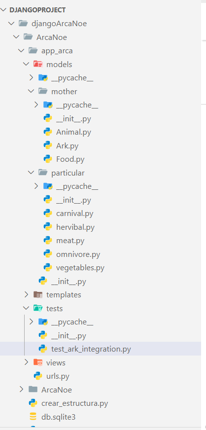

# TrabajoArca
# Razieh GHAHARTARS
# Carmen RAMÍREZ
## Desafío: Creando el Arca de Noé con Clases de Python
## ENUNCIADO 
En este ejercicio, desarrollaremos un modelo de la famosa Arca de Noé utilizando programación orientada a objetos en Python. Crearemos una clase estática `Arca` que tendrá la capacidad de almacenar tanto animales como alimentos y agua. La arca tendrá contenedores específicos y finitos, y proporcionará métodos para gestionar los alimentos y cuidar de los animales, incluyendo alimentarlos y darles agua. 

### Parte 1: Crear la Clase Arca

1. Define una clase estática llamada `Arca` con los siguientes atributos y métodos:
   - **Atributos**:
     - `animales` (lista): Una lista para almacenar instancias de la clase `Animal`.
     - `alimentos` (lista): Una lista para almacenar instancias de la clase `Alimento`.
     - `agua` (int): Un contenedor que almacena la cantidad total de agua disponible.
     - `capacidad_maxima` (int): Un límite para la cantidad total de animales y alimentos que puede contener el arca.
   - **Métodos**:
     - `__init__(cls, capacidad_maxima)`: El método constructor que inicializa la capacidad máxima del arca y crea listas vacías para animales y alimentos, además de establecer el agua a un valor inicial.
     - `agregar_animal(cls, animal)`: Un método que agrega un objeto `Animal` a la lista de animales si no se supera la capacidad máxima.
     - `agregar_alimento(cls, alimento)`: Un método que agrega un objeto `Alimento` a la lista de alimentos.
     - `agregar_agua(cls, cantidad)`: Un método que agrega agua al contenedor de agua.
     - `alimentar_animal(cls, animal)`: Un método que proporciona alimento a un animal específico.
     - `dar_agua(cls, animal)`: Un método que proporciona agua a un animal específico.
     - `estado_arca(cls)`: Un método estático que devuelve el estado actual de la arca, como el número de animales, alimentos y la cantidad de agua almacenados.

### Parte 2: Crear las Clases Padre Animal y Alimento

2. Define una clase llamada `Animal` con los siguientes atributos y métodos:
   - **Atributos**:
     - `nombre` (str): El nombre del animal.
     - `tipo` (str): El tipo de animal (por ejemplo, "perro", "gato").
     - `hambre` (int): Un nivel que indica cuánta hambre tiene el animal.
     - `sed` (int): Un nivel que indica cuánta sed tiene el animal.
   - **Métodos**:
     - `__init__(self, nombre, tipo)`: El método constructor que inicializa el nombre y tipo del animal, y establece hambre y sed a un valor inicial.
     - `alimentar(self)`: Un método que reduce el nivel de hambre del animal.
     - `dar_agua(self)`: Un método que reduce el nivel de sed del animal.
     - `estado(self)`: Un método que devuelve el estado actual de hambre y sed del animal.

3. Define una clase llamada `Alimento` con los siguientes atributos y métodos:
   - **Atributos**:
     - `tipo` (str): El tipo de alimento (por ejemplo, "heno", "croquetas").
     - `cantidad` (int): La cantidad de alimento disponible.
   - **Métodos**:
     - `__init__(self, tipo, cantidad)`: El método constructor que inicializa el tipo de alimento y la cantidad.
     - `usar(self, cantidad)`: Un método que reduce la cantidad de alimento disponible en la cantidad especificada.
     - `es_alimento_adecuado(cls, tipo_animal)`: Un método estático que verifica si un tipo de alimento es adecuado para un tipo de animal dado.

### Parte 3: Crear Clases Derivadas

4. Crea clases derivadas de `Animal` para diferentes tipos de animales (por ejemplo, `Perro`, `Gato`) que pueden tener métodos específicos o atributos adicionales.

5. Crea clases derivadas de `Alimento` para diferentes tipos de alimentos (por ejemplo, `Heno`, `Croquetas`) que pueden tener métodos específicos o atributos adicionales.

### Parte 4: Usando las Clases

6. Crea una instancia de la clase `Arca` con una capacidad máxima definida.

7. Crea instancias de los animales y alimentos derivados de sus respectivas clases padre.

8. Añade los animales y alimentos creados a la instancia de `Arca`.

9. Añade agua al contenedor de agua usando el método `agregar_agua`.

10. Simula el proceso de alimentar a los animales y darles agua utilizando los métodos correspondientes de la clase `Arca`.

11. Utiliza el método estático `estado_arca` para verificar el estado actual del arca.

### Desafíos Adicionales (Opcional, solo si tienes tiempo):

12. Implementa manejo de errores en tus clases para asegurar que no se puedan agregar más animales o alimentos que la capacidad máxima de la arca.

13. Crea un método para mostrar el estado de todos los animales en el arca, incluyendo su nombre, tipo, hambre y sed.

Este ejercicio te ayudará a comprender cómo usar la programación orientada a objetos para modelar un sistema más complejo, además de permitirte practicar la creación de jerarquías de clases y la interacción entre ellas. La inclusión de métodos estáticos también te dará experiencia en la implementación de funcionalidad que no depende del estado específico de una instancia.

# EXPLICACIÓN DEL PROYECTO

## Desarrollo de Clases y Uso de la Librería de Test de Django

En el marco de nuestro aprendizaje, hemos implementado clases de el arca de Noe.

Para asegurarnos de que estas clases funcionan correctamente, hemos utilizado la librería de pruebas de Django, que nos permite automatizar y validar el comportamiento esperado de nuestras aplicaciones. Django ofrece un módulo integrado para pruebas llamado django.test, que simplifica el proceso de escribir y ejecutar tests.

### Pasos que seguimos:
Definición de las Clases:
Las clases definidas son:

Configuración de las Pruebas: Utilizamos la funcionalidad de pruebas de Django para escribir un programa que verifica las clases implementadas.

### Uso de TestCase:

Django proporciona la clase TestCase como base para nuestras pruebas.
Creamos métodos dentro de esta clase para escribir pruebas específicas.

#### Ejecución de las Pruebas:

Ejecutamos las pruebas usando el comando:
  
   python manage.py test app_arca.tests.test_ark_integration

Esto activa el sistema de testing de Django, que ejecuta todos los métodos definidos en nuestras clases de prueba y muestra los resultados. La clase de prueba se usa para hacer una suerte 
de simulador de las clases y que simula el funcionamiento del arca de noe.

#### Resultado
El resultado es una simulacion de como los animales van teniendo hambre y van consumiendo los recursos del arca(agua y comida) La simulación acaba cuando los animales, el agua o la comida se quedan a 0.

##### Fragmento salida por consola
...
Herbivore33 no tiene sed
Herbivore34 no tiene sed
Herbivore35 no tiene sed
Herbivore36 no tiene sed
Omnivore37 no tiene sed
Omnivore38 no tiene sed
Carnivore39 no tiene sed
Omnivore40 no tiene sed
Carnivore41 no tiene sed
Herbivore42 no tiene sed
Carnivore43 no tiene sed
Herbivore44 no tiene sed
Carnivore45 no tiene sed
Carnivore46 no tiene sed
Omnivore47 no tiene sed
Herbivore48 no tiene sed
Omnivore49 no tiene sed
Animales en el arca: 50
Comida restante en el arca: 100
Agua restante en el arca: 68
=== Ciclo 2404 ===
Animales en el arca: 50
Comida restante en el arca: 100
Agua restante en el arca: 68
Herbivore0 no tiene sed
Omnivore1 no tiene sed
Herbivore2 no tiene sed
Omnivore3 no tiene sed
Herbivore4 no tiene sed
Herbivore5 no tiene sed
Omnivore6 no tiene sed
Carnivore7 no tiene sed
Carnivore8 no tiene sed
Omnivore9 no tiene sed
Carnivore10 no tiene sed
Herbivore11 no tiene sed
Carnivore12 no tiene sed
Herbivore13 no tiene sed
Carnivore14 no tiene sed
Carnivore15 no tiene sed
Herbivore16 no tiene sed
Omnivore17 no tiene sed
Carnivore18 no tiene sed
Omnivore19 no tiene sed
Omnivore20 no tiene sed
Herbivore21 no tiene sed
Carnivore22 no tiene sed
Omnivore23 no tiene sed
Carnivore24 no tiene sed
Carnivore25 no tiene sed
Carnivore26 no tiene sed
Omnivore27 no tiene sed
Herbivore28 no tiene sed
Herbivore29 no tiene sed
Omnivore30 no tiene sed
Carnivore31 no tiene sed
Carnivore32 no tiene sed
Herbivore33 no tiene sed
Herbivore34 no tiene sed
Herbivore35 no tiene sed
Herbivore36 no tiene sed
Omnivore37 no tiene sed
Omnivore38 no tiene sed
Carnivore39 no tiene sed
Omnivore40 no tiene sed
Carnivore41 no tiene sed
Herbivore42 no tiene sed
Carnivore43 no tiene sed
Herbivore44 no tiene sed
Carnivore45 no tiene sed
Carnivore46 no tiene sed
Omnivore47 no tiene sed
Herbivore48 no tiene sed
Omnivore49 no tiene sed
Animales en el arca: 50
Comida restante en el arca: 100
Agua restante en el arca: 68
=== Ciclo 2405 ===
Animales en el arca: 50
Comida restante en el arca: 100
Agua restante en el arca: 68
Herbivore0 no tiene sed
Omnivore1 no tiene sed
Herbivore2 no tiene sed
Omnivore3 no tiene sed
Herbivore4 no tiene sed
Herbivore0  is hungry.

Herbivore5 no tiene sed
Omnivore6 no tiene sed
Carnivore7 no tiene sed
Carnivore8 no tiene sed
Omnivore9 no tiene sed
Carnivore10 no tiene sed
Herbivore11 no tiene sed
Carnivore12 no tiene sed
Herbivore13 no tiene sed
Carnivore14 no tiene sed
Carnivore15 no tiene sed
Herbivore16 no tiene sed
Omnivore17 no tiene sed
Carnivore18 no tiene sed
Omnivore19 no tiene sed
Omnivore20 no tiene sed
Herbivore21 no tiene sed
Carnivore22 no tiene sed
Omnivore23 no tiene sed
Carnivore24 no tiene sed
Carnivore25 no tiene sed
Carnivore26 no tiene sed
Omnivore27 no tiene sed
Herbivore28 no tiene sed
Herbivore29 no tiene sed
Omnivore30 no tiene sed
Carnivore31 no tiene sed
Carnivore32 no tiene sed
Herbivore33 no tiene sed
Herbivore34 no tiene sed
Herbivore35 no tiene sed
Herbivore36 no tiene sed
Omnivore37 no tiene sed
Omnivore38 no tiene sed
Carnivore39 no tiene sed
Omnivore40 no tiene sed
Carnivore41 no tiene sed
Herbivore42 no tiene sed
Carnivore43 no tiene sed
Herbivore44 no tiene sed
Carnivore45 no tiene sed
Carnivore46 no tiene sed
Omnivore47 no tiene sed
Herbivore48 no tiene sed
Omnivore49 no tiene sed
Animales en el arca: 50
Comida restante en el arca: 100
Agua restante en el arca: 68
=== Ciclo 2406 ===
Animales en el arca: 50
Comida restante en el arca: 100
Agua restante en el arca: 68
Herbivore0 is not hungry.

Herbivore0 se ha alimentado.
Herbivore0 no tiene sed
Omnivore1 no tiene sed
Herbivore2 no tiene sed
Omnivore3 no tiene sed
Herbivore4 no tiene sed
Herbivore5 no tiene sed
Omnivore6 no tiene sed
Carnivore7 no tiene sed
Carnivore8 no tiene sed
Omnivore9 no tiene sed
Carnivore10 no tiene sed
Herbivore11 no tiene sed
Carnivore12 no tiene sed
Herbivore13 no tiene sed
Carnivore14 no tiene sed
Carnivore15 no tiene sed
Herbivore16 no tiene sed
Omnivore17 no tiene sed
Carnivore18 no tiene sed
Omnivore19 no tiene sed
Omnivore20 no tiene sed
Herbivore21 no tiene sed
Carnivore22 no tiene sed
Omnivore23 no tiene sed
Carnivore24 no tiene sed
Carnivore25 no tiene sed
Herbivore0 is thirsty.
Carnivore26 no tiene sed

Omnivore27 no tiene sed
Herbivore28 no tiene sed
Herbivore29 no tiene sed
Omnivore30 no tiene sed
Carnivore31 no tiene sed
Carnivore32 no tiene sed
Herbivore33 no tiene sed
Herbivore34 no tiene sed
Herbivore35 no tiene sed
Herbivore36 no tiene sed
Omnivore37 no tiene sed
Omnivore38 no tiene sed
Carnivore39 no tiene sed
Omnivore40 no tiene sed
Carnivore41 no tiene sed
Herbivore42 no tiene sed
Carnivore43 no tiene sed
Herbivore44 no tiene sed
Carnivore45 no tiene sed
Carnivore46 no tiene sed
Omnivore47 no tiene sed
Herbivore48 no tiene sed
Omnivore49 no tiene sed
Animales en el arca: 50
Comida restante en el arca: 100
Agua restante en el arca: 68
=== Ciclo 2407 ===
Animales en el arca: 50
Comida restante en el arca: 100
Agua restante en el arca: 68
Herbivore0 ha bebido
Omnivore1 no tiene sed
Herbivore2 no tiene sed
Omnivore3 no tiene sed
Herbivore4 no tiene sed
Herbivore5 no tiene sed
Omnivore6 no tiene sed
Carnivore7 no tiene sed
Carnivore8 no tiene sed
Omnivore9 no tiene sed
Carnivore10 no tiene sed
Herbivore11 no tiene sed
Carnivore12 no tiene sed
Herbivore13 no tiene sed
Carnivore14 no tiene sed
Carnivore15 no tiene sed
Herbivore16 no tiene sed
Omnivore17 no tiene sed
Carnivore18 no tiene sed
Omnivore19 no tiene sed
Omnivore20 no tiene sed
Herbivore21 no tiene sed
Carnivore22 no tiene sed
Omnivore23 no tiene sed
Carnivore24 no tiene sed
Carnivore25 no tiene sed
Carnivore26 no tiene sed
Omnivore27 no tiene sed
Herbivore28 no tiene sed
Herbivore29 no tiene sed
Omnivore30 no tiene sed
Carnivore31 no tiene sed
Carnivore32 no tiene sed
Herbivore33 no tiene sed
Herbivore34 no tiene sed
Herbivore35 no tiene sed
Herbivore36 no tiene sed
Omnivore37 no tiene sed
Omnivore38 no tiene sed
Carnivore39 no tiene sed
Omnivore40 no tiene sed
Carnivore41 no tiene sed
Omnivore1 is thirsty.

Herbivore42 no tiene sed
Omnivore1  is hungry.
Carnivore43 no tiene sed

Herbivore44 no tiene sed
Carnivore45 no tiene sed
Carnivore46 no tiene sed
Omnivore47 no tiene sed
Herbivore48 no tiene sed
Omnivore49 no tiene sed
Animales en el arca: 50
Comida restante en el arca: 100
Agua restante en el arca: 67
=== Ciclo 2408 ===
Animales en el arca: 50
Comida restante en el arca: 100
Agua restante en el arca: 67
Herbivore0 no tiene sed
Omnivore1 is not hungry.

Omnivore1 se ha alimentado.
Omnivore1 ha bebido
Herbivore2 no tiene sed
Omnivore3 no tiene sed
Herbivore4 no tiene sed
Herbivore5 no tiene sed
Omnivore6 no tiene sed
Carnivore7 no tiene sed
Carnivore8 no tiene sed
Omnivore9 no tiene sed
Carnivore10 no tiene sed
Herbivore11 no tiene sed
Carnivore12 no tiene sed
Herbivore13 no tiene sed
Carnivore14 no tiene sed
Carnivore15 no tiene sed
Herbivore16 no tiene sed
Omnivore17 no tiene sed
Carnivore18 no tiene sed
Omnivore19 no tiene sed
Omnivore20 no tiene sed
Herbivore21 no tiene sed
Carnivore22 no tiene sed
Omnivore23 no tiene sed
Carnivore24 no tiene sed
Carnivore25 no tiene sed
Carnivore26 no tiene sed
Omnivore27 no tiene sed
Herbivore28 no tiene sed
Herbivore29 no tiene sed
Omnivore30 no tiene sed
Carnivore31 no tiene sed
Carnivore32 no tiene sed
Herbivore33 no tiene sed
Herbivore34 no tiene sed
Herbivore35 no tiene sed
Herbivore36 no tiene sed
Omnivore37 no tiene sed
Omnivore38 no tiene sed
Carnivore39 no tiene sed
Omnivore40 no tiene sed
Carnivore41 no tiene sed
Herbivore42 no tiene sed
Carnivore43 no tiene sed
Herbivore44 no tiene sed
Carnivore45 no tiene sed
Carnivore46 no tiene sed
Omnivore47 no tiene sed
Herbivore48 no tiene sed
Omnivore49 no tiene sed
Animales en el arca: 50
Herbivore2  is hungry.
Comida restante en el arca: 100
Herbivore5  is hungry.

Omnivore3 is thirsty.
Omnivore3  is hungry.

Herbivore13 is thirsty.
Carnivore12 is thirsty.

Herbivore11  is hungry.

Carnivore10  is hungry.

Carnivore7  is hungry.

Omnivore9 is thirsty.

Omnivore6 is thirsty.

Herbivore2 is thirsty.

Herbivore13  is hungry.

Carnivore15  is hungry.

Herbivore11 is thirsty.

Carnivore8 is thirsty.

Omnivore6  is hungry.

Agua restante en el arca: 66
Carnivore14 is thirsty.

Carnivore12  is hungry.

Carnivore10 is thirsty.
Omnivore9  is hungry.

Herbivore4  is hungry.

Carnivore14  is hungry.

Carnivore7 is thirsty.

=== Ciclo 2409 ===
Carnivore15 is thirsty.

Herbivore5 is thirsty.
Animales en el arca: 50
Carnivore8  is hungry.

Herbivore4 is thirsty.
Comida restante en el arca: 100

Agua restante en el arca: 66
Herbivore28 is thirsty.

Omnivore20 is thirsty.

Carnivore24 is thirsty.

Carnivore26 is thirsty.

Herbivore16 is thirsty.

Omnivore30 is thirsty.

Herbivore28  is hungry.

Carnivore25  is hungry.

Herbivore21 is thirsty.

Omnivore17  is hungry.

Omnivore19 is thirsty.

Omnivore23  is hungry.

Carnivore18 is thirsty.

Herbivore0 no tiene sed
Omnivore30  is hungry.
Carnivore22  is hungry.

Carnivore22 is thirsty.

Herbivore21  is hungry.

Omnivore17 is thirsty.
Carnivore26  is hungry.
Omnivore23 is thirsty.
Herbivore29  is hungry.

Omnivore27  is hungry.
Omnivore27 is thirsty.
Herbivore16  is hungry.
Herbivore29 is thirsty.

Carnivore25 is thirsty.

Carnivore24  is hungry.
Omnivore20  is hungry.

Carnivore18  is hungry.

Omnivore1 no tiene sed
Omnivore19  is hungry.

Herbivore2 is not hungry.

Herbivore44 is thirsty.
Herbivore44  is hungry.

Omnivore38  is hungry.
Omnivore40 is thirsty.

Carnivore39  is hungry.
Herbivore35 is thirsty.

Herbivore35  is hungry.

Omnivore38 is thirsty.
Herbivore42 is thirsty.
Carnivore41 is thirsty.
Omnivore37  is hungry.
Herbivore36  is hungry.
Herbivore34 is thirsty.
Herbivore36 is thirsty.
Herbivore33 is thirsty.
Carnivore32  is hungry.
Carnivore31  is hungry.

Carnivore43 is thirsty.
Carnivore41  is hungry.

Omnivore37 is thirsty.
Herbivore42  is hungry.
Herbivore33  is hungry.

Carnivore32 is thirsty.

Herbivore2 se ha alimentado.
Carnivore31 is thirsty.

Carnivore43  is hungry.

Omnivore40  is hungry.

Carnivore39 is thirsty.

Herbivore2 ha bebido

100
Herbivore34  is hungry.
Omnivore3 is not hungry.

Omnivore3 se ha alimentado.
Herbivore48 is thirsty.
Herbivore48  is hungry.
Carnivore46 is thirsty.
Carnivore45 is thirsty.
Carnivore46  is hungry.

Omnivore49  is hungry.

Omnivore47 is thirsty.

Omnivore49 is thirsty.

Carnivore45  is hungry.

Omnivore47  is hungry.

Omnivore3 ha bebido
Herbivore4  is hungry.

Herbivore4 ha muerto por falta de comida.
Herbivore4 ha bebido
Omnivore6  is hungry.

Omnivore6 ha muerto por falta de comida.
Omnivore6 ha bebido
Carnivore8  is hungry.

Carnivore8 ha muerto por falta de comida.
Carnivore8 ha bebido
Carnivore10  is hungry.

Carnivore10 ha muerto por falta de comida.
Carnivore10 ha bebido
Carnivore12  is hungry.

Carnivore12 ha muerto por falta de comida.
Carnivore12 ha bebido
Carnivore14  is hungry.

Carnivore14 ha muerto por falta de comida.
Carnivore14 ha bebido
Herbivore16  is hungry.

Herbivore16 ha muerto por falta de comida.
Herbivore16 ha bebido
Carnivore18  is hungry.

Carnivore18 ha muerto por falta de comida.
Carnivore18 ha bebido
Omnivore20  is hungry.

Omnivore20 ha muerto por falta de comida.
Omnivore20 ha bebido
Carnivore22  is hungry.

Carnivore22 ha muerto por falta de comida.
Carnivore22 ha bebido
Carnivore24  is hungry.

Carnivore24 ha muerto por falta de comida.
Carnivore24 ha bebido
Carnivore26  is hungry.

Carnivore26 ha muerto por falta de comida.
Carnivore26 ha bebido
Herbivore28  is hungry.

Herbivore28 ha muerto por falta de comida.
Herbivore28 ha bebido
Omnivore30  is hungry.

Omnivore30 ha muerto por falta de comida.
Omnivore30 ha bebido
Carnivore32  is hungry.

Carnivore32 ha muerto por falta de comida.
Carnivore32 ha bebido
Herbivore34  is hungry.

Herbivore34 ha muerto por falta de comida.
Herbivore34 ha bebido
Herbivore36  is hungry.

Herbivore36 ha muerto por falta de comida.
Herbivore36 ha bebido
Omnivore38  is hungry.

Omnivore38 ha muerto por falta de comida.
Omnivore38 ha bebido
Omnivore40  is hungry.

Omnivore40 ha muerto por falta de comida.
Omnivore40 ha bebido
Herbivore42  is hungry.

Herbivore42 ha muerto por falta de comida.
Herbivore42 ha bebido
Herbivore44  is hungry.

Herbivore44 ha muerto por falta de comida.
Herbivore44 ha bebido
Carnivore46  is hungry.

Carnivore46 ha muerto por falta de comida.
Carnivore46 ha bebido
Herbivore48  is hungry.

Herbivore48 ha muerto por falta de comida.
Herbivore48 ha bebido
Animales en el arca: 27
Comida restante en el arca: 0
Agua restante en el arca: 41
=== FIN DE LA SIMULACIÓN DEL ARCA ===
Animales en el arca: 27
Comida restante en el arca: 0
Agua restante en el arca: 41
=== SUPERVIVIENTES FINALES ===
id: 5JCQ
Name: Herbivore0
Type: Herbivore
Size: 8
Sex: Male
Feeling: Playful
Is Hungry: No
Is Thirsty: No
id: Vso2
Name: Omnivore1
Type: Omnivore
Size: 1
Sex: Male
Feeling: Territoriality
Is Hungry: No
Is Thirsty: No
id: kYuG
Name: Herbivore2
Type: Herbivore
Size: 3
Sex: Male
Feeling: Sleepy
Is Hungry: No
Is Thirsty: No
id: j4fM
Name: Omnivore3
Type: Omnivore
Size: 10
Sex: Female
Feeling: Happy
Is Hungry: No
Is Thirsty: No
id: uikX
Name: Herbivore5
Type: Herbivore
Size: 10
Sex: Male
Feeling: Happy
Is Hungry: Yes
Is Thirsty: Yes
id: ioBU
Name: Carnivore7
Type: Carnivore
Size: 2
Sex: Male
Feeling: Angry
Is Hungry: Yes
Is Thirsty: Yes
id: WviR
Name: Omnivore9
Type: Omnivore
Size: 4
Sex: Male
Feeling: Sleepy
Is Hungry: Yes
Is Thirsty: Yes
id: kfQe
Name: Herbivore11
Type: Herbivore
Size: 5
Sex: Male
Feeling: Sad
Is Hungry: Yes
Is Thirsty: Yes
id: wf5o
Name: Herbivore13
Type: Herbivore
Size: 7
Sex: Male
Feeling: Playful
Is Hungry: Yes
Is Thirsty: Yes
id: 6spE
Name: Carnivore15
Type: Carnivore
Size: 4
Sex: Female
Feeling: In-Love
Is Hungry: Yes
Is Thirsty: Yes
id: hx4K
Name: Omnivore17
Type: Omnivore
Size: 3
Sex: Male
Feeling: Sleepy
Is Hungry: Yes
Is Thirsty: Yes
id: t3MM
Name: Omnivore19
Type: Omnivore
Size: 1
Sex: Male
Feeling: Afraid
Is Hungry: Yes
Is Thirsty: Yes
id: 2ZNp
Name: Herbivore21
Type: Herbivore
Size: 9
Sex: Female
Feeling: Happy
Is Hungry: Yes
Is Thirsty: Yes
id: YKhT
Name: Omnivore23
Type: Omnivore
Size: 6
Sex: Female
Feeling: Angry
Is Hungry: Yes
Is Thirsty: Yes
id: 9B8o
Name: Carnivore25
Type: Carnivore
Size: 9
Sex: Female
Feeling: Playful
Is Hungry: Yes
Is Thirsty: Yes
id: Hgwv
Name: Omnivore27
Type: Omnivore
Size: 4
Sex: Male
Feeling: In-Love
Is Hungry: Yes
Is Thirsty: Yes
id: wos7
Name: Herbivore29
Type: Herbivore
Size: 10
Sex: Male
Feeling: Sleepy
Is Hungry: Yes
Is Thirsty: Yes
id: We8d
Name: Carnivore31
Type: Carnivore
Size: 3
Sex: Female
Feeling: Happy
Is Hungry: Yes
Is Thirsty: Yes
id: iFLh
Name: Herbivore33
Type: Herbivore
Size: 3
Sex: Male
Feeling: Sad
Is Hungry: Yes
Is Thirsty: Yes
id: MCUB
Name: Herbivore35
Type: Herbivore
Size: 10
Sex: Female
Feeling: Playful
Is Hungry: Yes
Is Thirsty: Yes
id: 4svu
Name: Omnivore37
Type: Omnivore
Size: 8
Sex: Female
Feeling: Playful
Is Hungry: Yes
Is Thirsty: Yes
id: yShJ
Name: Carnivore39
Type: Carnivore
Size: 3
Sex: Female
Feeling: Playful
Is Hungry: Yes
Is Thirsty: Yes
id: EQFe
Name: Carnivore41
Type: Carnivore
Size: 5
Sex: Female
Feeling: Happy
Is Hungry: Yes
Is Thirsty: Yes
id: tFnA
Name: Carnivore43
Type: Carnivore
Size: 1
Sex: Female
Feeling: Sleepy
Is Hungry: Yes
Is Thirsty: Yes
id: Gxib
Name: Carnivore45
Type: Carnivore
Size: 3
Sex: Male
Feeling: Sleepy
Is Hungry: Yes
Is Thirsty: Yes
id: hUzc
Name: Omnivore47
Type: Omnivore
Size: 1
Sex: Male
Feeling: Afraid
Is Hungry: Yes
Is Thirsty: Yes
id: Ryo5
Name: Omnivore49
Type: Omnivore
Size: 7
Sex: Male
Feeling: Angry
Is Hungry: Yes
Is Thirsty: Yes
=== FIN ===
.=== TEST 2 ===
=== INICIO DE LA SIMULACIÓN DEL ARCA ===

--- Añadiendo Animales al Arca ---
Animales actuales en el arca: 3

--- Añadiendo Alimentos al Arca ---
Cantidad actual de comida en el arca: 2

--- Añadiendo Agua al Arca ---
Cantidad actual de agua en el arca: 500

--- Alimentando a los Animales ---
Deer is not hungry.

Deer se ha alimentado.
Bear is not hungry.

Bear se ha alimentado.
Deer está satisfecho
Tiger está satisfecho
Bear está satisfecho

--- Hidratando a los Animales ---
Deer ha bebido
Tiger no tiene sed
Bear ha bebido
Deer está hidratado
Tiger está hidratado
Bear está hidratado

=== ESTADO FINAL DEL ARCA 2 ===
Animales en el arca: 3
Comida restante en el arca: 2
Agua restante en el arca: 498
=== FIN DE LA SIMULACIÓN DEL ARCA 2===
.
----------------------------------------------------------------------
Ran 2 tests in 30.352s

OK

# ENLACES DEL PROYECTO
## CLICK UP
https://app.clickup.com/t/8696kpmqq

## Repositorios
### Principal
https://github.com/Laquesis/TrabajoArca
### Django
https://github.com/Laquesis/djangoArcaNoe

## Diagrama de clases
https://miro.com/welcomeonboard/MzR4SDRIVEhXYTBQWHZPOTJDZWNNY0pyRXNvOHhXb1BqNTB6YVFRQ1VFSGtWSU1vd0JHRnNwc2Q1enlkOTBOQlFOQW4vRGZ3ZnBiNmJHRmtxNWlHTjBQa3JFajV1d0lmbDM1WGhncGN6Zmg3TktoN21SL2lsNkQ3ZFhOSzdxUEshZQ==?share_link_id=706057329282

